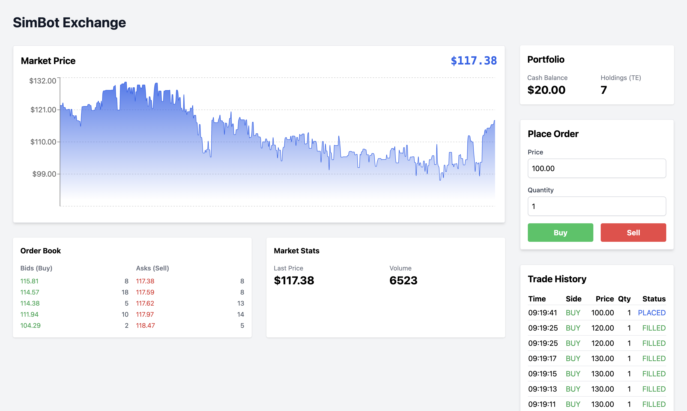
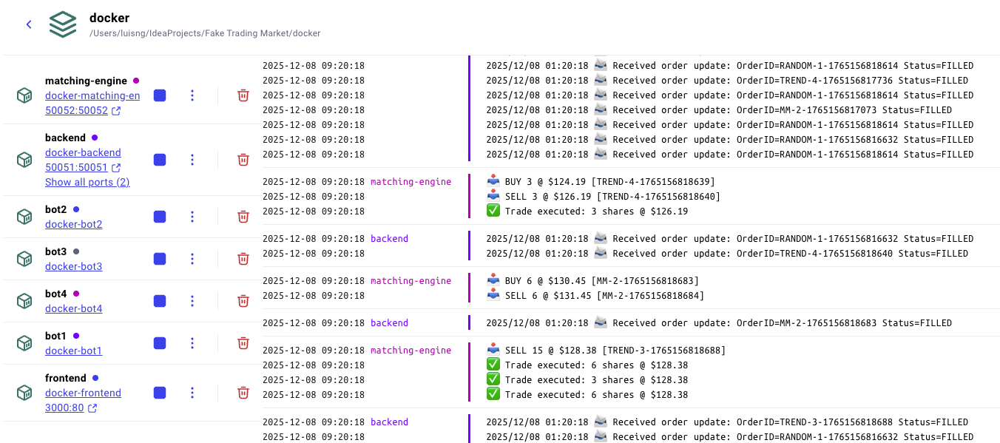

# SimBot Exchange

A real-time stock market simulator with a matching engine, trading bots, and a web-based trading interface.



## Quick Start (Docker)

**Prerequisites:** [Docker Desktop](https://www.docker.com/products/docker-desktop/) installed and running.

```bash
# Clone the repository
git clone https://github.com/mud-3/simbot-exchange.git
cd simbot-exchange

# Start everything with 1 line of command
chmod +x start_docker.sh && ./start_docker.sh
```

That's it! Open **http://localhost:3000** in your browser to start trading.

## What's Running

| Service | Description | Port |
|---------|-------------|------|
| **Frontend** | React trading interface | http://localhost:3000 |
| **Backend Gateway** | Go API server | http://localhost:8080 |
| **Matching Engine** | C++ order matching | localhost:50052 |
| **Bot 1** | Random Trader | - |
| **Bot 2** | Market Maker | - |
| **Bots 3-4** | Trend Creators | - |



## How to Play

1. **Open the app** at http://localhost:3000
2. **You start with $1,000** cash and 0 shares
3. **Place BUY orders** to purchase shares (cash is deducted)
4. **Place SELL orders** to sell shares (you receive cash)
5. **Watch the bots trade** and try to profit from price movements!

### Order Matching Rules
- **BUY at $X** → Matches any SELL order ≤ $X
- **SELL at $X** → Matches any BUY order ≥ $X
- Orders that don't match immediately stay in the order book

### Trading Tips
- Watch the price chart for trends
- Look at the order book to see supply/demand
- The bots create market volatility - use it to your advantage!

## Stop the App

```bash
./stop_docker.sh
```

Or manually:
```bash
cd docker && docker-compose down
```

## Architecture

**Technologies between components**
- **Frontend → Backend**
  - HTTP REST (port 8080) – `POST /order` to place orders
  - WebSocket (ws://localhost:8080/ws) – real-time market data & order fills
- **Bots → Backend**
  - gRPC (port 50051) – place orders & subscribe to market data via Go gateway
- **Backend → Matching Engine**
  - gRPC (internal, port 50052) – order routing & market data from C++ engine

```
                                        ┌───────────┐  ┌───────────┐  ┌───────────┐
                                        │  Bot 1    │  │  Bot 2    │  │ Bots 3-4  │
                                        │  Random   │  │   MM      │  │  Trend    │
                                        └─────┬─────┘  └─────┬─────┘  └─────┬─────┘
                                              │              │              │
                                              │  gRPC (50051)│              │
                                              └──────────────┼──────────────┘
                                                             ▼
┌─────────────────┐   HTTP + WebSocket  ┌──────────────────────────────┐
│    Frontend     │────────────────────▶│  Backend Gateway (Go)        │
│    (React)      │◀────────────────────│  :8080 HTTP / :50051 gRPC    │
└─────────────────┘                     └───────────────┬──────────────┘
                                                        │ gRPC (50052)
                                                        ▼
                                               ┌─────────────────┐
                                               │ Matching Engine │
                                               │     (C++)       │
                                               └─────────────────┘
```

## Bot Types

| Bot | Strategy | Behavior |
|-----|----------|----------|
| **Random Trader** | None | Places random buy/sell orders. Creates noise. |
| **Market Maker** | Spread | Places both buy and sell orders. Provides liquidity. |
| **Trend Creator** | Momentum | Picks a direction and pushes the market. Creates trends. |

## Project Structure

```
├── services/
│   ├── matching_engine_cpp/   # C++ order matching engine
│   ├── backend_go/            # Go API gateway
│   ├── bots_python/           # Python trading bots
│   └── frontend_react/        # React web interface
├── docker/
│   ├── docker-compose.yaml    # Docker orchestration
│   └── *.Dockerfile           # Container definitions
├── proto/                     # gRPC protocol definitions
├── start_docker.sh            # Start with Docker
└── stop_docker.sh             # Stop Docker services
```

---

**Happy Trading!**
